## Roller coaster render project

This is the second homework of the computer graphics course. In this project, I will render the roller coaster by OpenGL. The input is a group of points position, and I will use spline interpolation to create the track, and use OpenGL to render it.

The rendering result is:


Environment for this project:

- Windows OS

- visual studio 2017 or higher version

External library:

- GLUT: create the window
- GLEW: for OpenGL
- GLM: OpenGL Mathematics  library
- jpeg: for loading the height map

Features of this project:

- B Spline to get C2 continuous with uniform step
- Generate track by the spline
- Use physical simulation to control the speed of the ride
- Render shadow of the track
- Render sky box

Keyboard and mouse control:

- Drag mouse:
  - Drag mouse left button: rotate the model along x or y axis
  - Drag mouse middle button: rotate the model along z axis
- Control + drag mouse:
  - Control + drag mouse left button: translate the model along x or y axis
  - Control + drag mouse middle button:  translate the model along z axis
- Shift + drag mouse:
  - Shift+ drag mouse left button: scale the model along x or y axis
  - Shift+ drag mouse middle button:  scale the model along z axis
- Keyboard action:
  - press key 1: static mode. You will see the roller coaster track model
  - press key 2: ride mode. You will ride on the roller coaster
  - press key 3: switch render style. There are 3 render styles:
    - color style: The color of the track defined by the normal of the vertex
    - Phone shading style: Use Phone shading to render the track
    - Phone shading + texture: Final complete render mode.

How to use?

1. Click rollerCoaster.sln to run the source project
2. The demonstration folder show the rendering image
3. The release folder has the compiled version of the project. To run the program, you need to provide one parameter as the input height map path. You can also click render.bat to start the demo
4. The Bin folder contain the output of visual studio. Mind that this program need glew32.dll and freeglut.dll, so you need to put this two files into the folder that contain output the exe file.


---

Technical details:

### 1. The normal of the spline  

When move the camera ride on the coaster, beside the position of each vertex of the spline, we also need to know the tangent and the normal of the spline. Here I place the camera on the position of the spline, face toward the (position + tangent) direction, and using normal as the up vector. Specifically is: LookAt(position.x, position.y, position.z, position.x + tangent.x, position.y + tangent.y, position.z + tangent.z, normal.x, normal.y, normal.z);

By using the Sloan's method, the result looks not real for two aspects:

1. The algorithm pick an arbitrary vector V as the initial state. However, the result of this algorithm relay on the initial state. Which means this algorithm is a stochastic algorithm. We need a determinate algorithm.

2. When ride on the track, the track in front of the camera has slope, which looks not real.

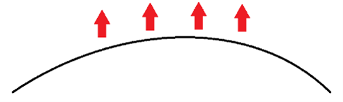

For example, if we have such a track above, we want to ride above the track, which means the normal should point upward. But Sloan's method can not get such a result.

So, here is how I do this.

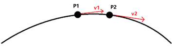

Suppose the tangent of P1 is v1, and the tangent of the next vertex of P1 is v2. The binormal of P1 should be b1 = v1 × v2. And the normal of P1 should be n1 = v1 × b1.

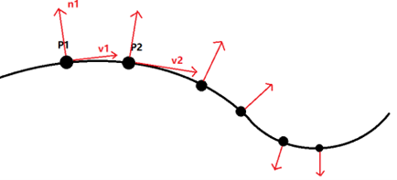

Until here, you may notice that the normal always point outward the concave area. The spline above show how this method failed. The normal will flip abruptly on the joint of the concave and convex part. So, I will need to check and flip the normal, this is how I do in pseudo code:

```pseudocode
for normal in normal_list:
	if previous_normal * normal < 0:  // the joint position
		normal = - normal // then flip the normal
	previous_normal = normal
```

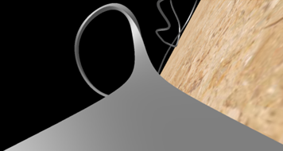


### 2. The vertex of the track and how to deal with the joint position.

The black line below is the spline, and the green line is the vertex of the track. The track is generated according to the normal and the binormal of the spline.  

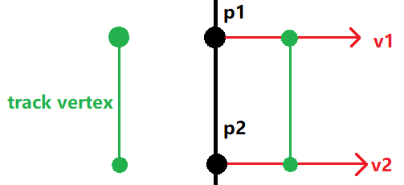

But mind that to calculate the normal of the vertex of the spline, I use the cross product of 2 contiguous tangents, which is equal to 3 vertices position. 3 contiguous vertices position can determine a quadratic function. To make the quadratic function smooth in the joint, the spline need be at least C2 continuous. 

When using Catmull Rom Spline, which is C1 continuous, I get the following track, there is artifact in the joint position.

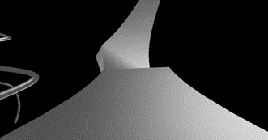

This problem can be solved by using C2 continuous spline. Here I use B Splines. The only problem is that B spline does not pass the vertex we provide. Here, natural spline can solve this problem, but since it has lots of complex calculations, I decide not to use it.

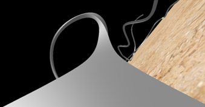


### 3. Generate uniform speed spline

The course slide mentioned recursive subdivision algorithm to generate uniform speed spline. But using recursive algorithm is slow due to the function call. Here I want to improve this algorithm by using stack. You can check the code in the splineInterpolationRS function in rollerCoaster.cpp file. Here is the pseudo code of how I generate the uniform speed spline by using stack.  

```c++
start_point = fun(0) // calculate the start point position when u = 0
spline_list.push_back(start_point) // spline_list store all the vertex of the spline
stack<pair<float, float>> subdivision_tree // the stack structure tree
subdivision_tree.push({0, 1}) // push the initial line segment
while (!subdivision_tree.empty()) {
first_u, second_u = subdivision_tree.top()
subdivision_tree.pop() // get the top item
	first_point = fun(first_u); second_point = fun(second_u); 
	if distance(first_point, second_point) < threshold: // push into the list
		spline_list.push_back(second_point)
	else:
		middle_u = (first_u + second_u) / 2
		subdivision_tree.push({middle_u, second_u})
		subdivision_tree.push({first_u, middle_u })

```

I use goodRide.sp as an example, generate B Splines. First, I use the brute force algorithm, interpolating 50 vertices of each two points. Then, I use the uniform speed algorithm that I mentioned above, choosing 0.1 as the threshold. And here is the statistic I got from the two splines I created:  

1. brute force algorithm

- Total 4500 segment. 

- Total length: 154.481. 

- Average length: 0.0686584. 

- Length standard deviation: 0.0200213.

- Maximum length: 0.196158. 

- Minimum length: 0.0253739.

2. uniform speed algorithm

- Total 4364 segment. 

- Length: 154.48. 

- Average length: 0.0707974. 

- Length standard deviation: 0.0103522

- Maximum length: 0.099981. 

- Minimum length: 0.0497747.

From the standard deviation I got, we can find that the spline generated by the uniform speed algorithm is more even.


### 4. Rendering a sky box

The texture of the sky box I use is from Unity standard asset. Rendering the sky box is really tricky. There are totally 6 images to form the front, back, left, right, up, and down of the sky box. You need to put the image on the correct position. And the image may also flip horizontally. First, I pin down the up image. And then put the rest of the images one by one and test for the right order and position. 

Then I got this:

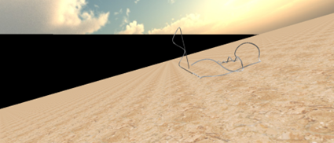

There is black part in the sky box. I check for all the code I write, and find no error happened. Then I noticed that maybe something wrong for the Perspective Viewing function. I place my sky box in x, y, z = -1000 and 1000, and coincidently, the perspective projection is:

```c++
matrix.Perspective(54.0f, (float)w / (float)h, 0.01f, 1000.0f);
```

The field of view cannot exceed 1000 in this case. So, I change the “far” parameter to 2000.0f, which solve the problem.

And also, I adjust the light source position according to the position of sun of the sky box, to make it looks more real. But there are also seam in the boarder of the image (left image below), I use the following setting to solve this problem (right image below).

```c++
glTexParameteri(GL_TEXTURE_2D, GL_TEXTURE_WRAP_S, GL_CLAMP_TO_EDGE);
```

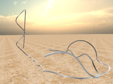


### 5. physically realistic updating

You can check this function for more information rollerCoaster::matrixMode_ride()

Generally, here is how I do:

1. Initialize the variable. Set current camera status (position, normal, and tangent), find the maximum and minimum height of the spline track, calculate the gravitational potential energy according to the height of the track. We must let the camera pass the maximum height position, so the initial energy must greater than the total gravitational potential energy.

2. Each time when updating the camera position, calculate the speed first. Then calculate the updating distance according to the speed and FPS (frame per second). 

3. Calculate the distance from current position to the next vertex position. If this distance is less than the updating distance (see figure below), that means the next position must be after p1. Then minus this distance from the updating distance, and set current position equal to p1. Doing this step 3 until the distance from current position to the next vertex position is less than the updating distance.

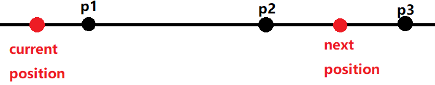

4. Now the distance from current position to the next vertex position is greater than the updating distance. We stand on p2 (figure above). Calculate the next position according to the ratio between the current position and the next vertex position, and put the camera at this position.

To check this part, please run the program.


### 6. Problems and Solutions for drawing shadow

##### 6.1 The shadow is completely dark, which looks not real. 

Even if I set ` c = vec4(0.0f, 0.0f, 0.0f, 0.5f);` It is still not translucent.

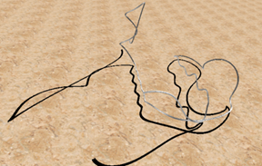

Solution is that, I need to enable alpha channel blending somewhere in my program.

```c++
glEnable(GL_BLEND); // enable blending
glBlendFunc(GL_SRC_ALPHA, GL_ONE_MINUS_SRC_ALPHA); // set blend function
```

##### 6.2 Z-buffer fighting

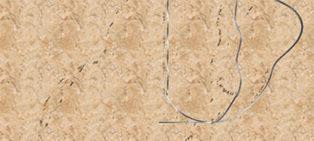

This can be solved by the 4-steps algorithm.

```c++
// 1. Set depth buffer to read-only, draw surface
glDepthMask(GL_FALSE);
drawGroundTexture();
// 2. Set depth buffer to read-write, draw shadow
glDepthMask(GL_TRUE);
drawShadow();
// 3. Set color buffer to read-only, draw surface again
GLboolean colorMask[4];
glGetBooleanv(GL_COLOR_WRITEMASK, colorMask); // save current color mask
glColorMask(GL_FALSE, GL_FALSE, GL_FALSE, GL_FALSE);
drawGroundTexture();
// 4. Set color buffer to read-write
glColorMask(colorMask[0], colorMask[1], colorMask[2], colorMask[3]);
```

Finally, I got the following effect. (I change another ground texture image)

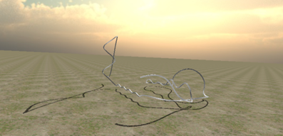
